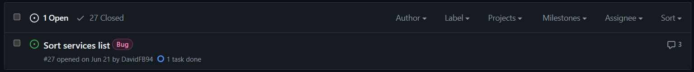
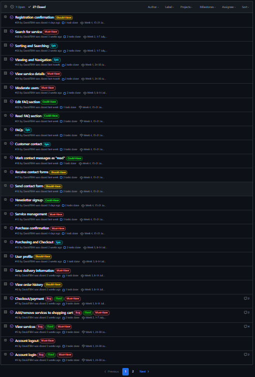

# [ProFit-PT](https://pro-fit-pt-dcb56d3b7224.herokuapp.com)

[](https://github.com/DavidFB94/pro-fit-pt/commits/main)

[](https://github.com/DavidFB94/pro-fit-pt/commits/main)

[](https://github.com/DavidFB94/pro-fit-pt)

## Overview

ProFit-PT is an e-commerce website where the customer can hire personal trainers for in person training, creating personalized workout plans, and fitness counseling.

This website was built as a project for the Diploma in Full Stack Software Development at Code Institute.

## Mockup


## UX

I started out with Wireframes for both desktop and mobile.

The basic structure for services and service details was created. I did not have any wireframes for the profile/cart/checkout, so I used the CI Boutique Ado walk-through for those pages.

After the base structure for viewing and purchasing services was complete, I moved on the the about/faqs/contact pages. Originally, I had planned for separate pages for all of them, but as the pages started taking shape, I combined some of their functionalities to make related information easier to find.

### Colour Scheme

-  `##4C4C4C` used for primary text.

-  `#f5f5f5` used for primary highlights.

-  `#FFFFFF` used for secondary text.

-  `#4C4C4CBF` used for secondary highlights.

I used [coolors.co](https://coolors.co/ffffff-f5f5f5-4c4c4c) to generate my colour palette.


### Typography

- [Lato](https://fonts.google.com/specimen/Lato) was used for all text.

- [Font Awesome](https://fontawesome.com) icons were used throughout the site, such as the search icon and tag icon for categories.

## User Stories

### Site Users

- As a customer I can register an account so that I can log in, and use the site in an authorized and secure way.

- As a customer I can  receive a email confirmation after account registration so that I know that my registration was successful.

- As a customer I can log in with my account information so that I can fully use the sites features.

- As a customer I can log out from my account so that I can avoid unauthorized access to my data.

- As a customer I can view services so that I can see the sites supply.

- As a customer I can view service details so that I can see detailed service information and make informed purchasing decisions.

- As a customer I can search for a service by name or description so that I can find a specific service I'd like to purchase.

- As a customer I can sort the list of services so that I can easily identify the product I might be interested in.

- As a customer I can add services to my shopping cart, view the contents of my cart and proceed to checkout, so that I can complete my purchase quickly and easily.

- As a customer I can proceed to checkout/payment so that I can pay for my services and enter my delivery information.

- As a customer I can receive a purchase confirmation e-mail so that I know that my order was successful.

- As a customer I can access my profile so that add/review information about my account.

- As a customer I can save my information so that I can have a faster checkout process when coming back to the site.

- As a customer I can view my order history so that I can track my purchases.

- As a customer I can fill out a contact form so that I can send messages to the site admin.

- As a customer I can find a FAQ section so that I can easily find answers to common questions regarding the site.

- (Future Feature) As a customer I can sign up for a newsletter so that I can receive the latest news and deals.

### Site Admin

- As a site admin I can moderate users and their data in the admin dashboard so that I can make changes when required.

- As a site admin I can receive a contact form so that I can have direct contact with the customers.

- As a site admin I can mark contact messages as "read" so that I can keep track on which messages I have reviewed.

- As a site admin I can add/edit/delete FAQs so that I can make the site easier to use for the customer.

- As a site admin I can add/edit/delete services so that I can manage my service inventory.

- (Future Feature) As a site admin I can send mass emails to users, if they have signed up for it, so that I can increase traffic and sales on the site.

## Wireframes
Wireframes were developed for mobile and desktop sizes.

I've used [Balsamiq](https://balsamiq.com/wireframes) to design my site wireframes.

### Mobile Wireframes

<details>
<summary> Click here to see the Mobile Wireframes </summary>

Home
- 

Services
- 

Service Details
- 

About
- 

Contact
- 

FAQs
- 

</details>

### Desktop Wireframes

<details>
<summary> Click here to see the Desktop Wireframes </summary>

Home
- 

Services
- 

Service Details
- 

About
- 

Contact
- 

FAQs
- 

</details>

## Features

### Existing Features

 **#1 Header with Logo home redirect**

- Adds maneuverability to the site.


**#2 Navbar links to "Our Services"  in drop-down menu**

-  Includes links to all services and service categories. Adds maneuverability to the site.


**#3 Navbar links to About/FAQs and Contact section**

- Adds maneuverability to the site.


**#4 Search field**

- For search queries. Adds maneuverability to the site. Makes it easier for the user to find what they are looking for.


**#5 "My Account" drop-down menu**

- Includes link to register/login/logout, profile page (registered users), and "Add Services" (for admin users only). Adds maneuverability to the site.


**#6 Cart display**

- Updates with cart content being added. Displays total cost. Link to "Shopping cart". Adds maneuverability to the site. Provides visual feedback for the user. Displays a cart preview when an item is added, with link to shopping cart.


**#7 Site Banner**

- Highlights the sites deal to get price reduction for buying more services at once. Will encourage users to buy more.


**#8 Feedback messages**

- Toast messages are displayed on user action. Message: Success, Error and Info. Provides instant feedback to the user.


**#9 Landing page**

- Includes inspiring message for the sites services and link to Personal Training category. Adds maneuverability to the site. Makes it easy for the user to find the sites main service.


**#10 Our services cards**

- Services display with all services, shown in a paginated list. Includes "Services home" link, number of found services, sorting and current category (if selected). Displays service name, image, category tag, description and starting price.


**#11 Service cards edit/delete links (ADMIN ONLY)**

-  Links to edit/delete a service (ADMIN ONLY). Includes a delete confirmation popup modal.


**#12 Service cards Read More link**

- "Read More" link to service details.


**#13 Service details**

- Display service details. Displays service name, image, category tag, full description. Includes "Buy sessions" section, with quantity selection drop-down, price per unit + total price, and "Add to cart" link. Also includes edit/delete links (ADMIN ONLY).


**#14 Shopping Cart**

- Displays items in the cart with service info and grand total. Includes links to keep shopping, remove an item and checkout.


**#15 Checkout**

- Checkout form with order summery. Includes option to save customer information to their profile (if registered user), card payments with Stripe, link back to current cart, total charge amount, and complete order button.


**#16 User registration**

- Sign Up form for user registration. Includes links to home page, and sign up button for completing the form. User verification
by email.


**#17 User Sign in**

- Sign in form for user login. Includes links to home page, and confirmation button for signing in. 


**#18 User Log out**

- Log out screen with log out confirmation. 


**#19 User Profile**

- Default User Information form and order history. Includes option to save/update customer information to their profile (if registered user), which will be used in the next checkout. Order history includes links to the order summary on previous orders.


**#20 About/FAQs page**

- About us section with site description, links to partners, facebook and privacy statement. FAQs section with accordion to save screen space (FAQs can be added/edited/removed in admin dashboard).


**21 Contact page**

- Includes contact form to send a message to the admin (can be read in the contacs tab in the dashboard) and a section for phone contact and phone-line operating hours. 


### Future Features

 **#1 Newsletter signup**

- Newsletter signup form, to add the email address to the database for newsletter emails.

 **#2 Sending mass emails**

- Sending emails to all users that has signed up for the newsletter.

 **#3 Front end pricing tier creation**

- Allowing for new pricing tiers to be created in the front end for admins

## Tools & Technologies Used

- [](https://tim.2bn.dev/markdown-builder) used to generate README and TESTING templates.

- [](https://git-scm.com) used for version control. (`git add`, `git commit`, `git push`)

- [](https://github.com) used for secure online code storage.

- [](https://gitpod.io) used as a cloud-based IDE for development.

- [](https://en.wikipedia.org/wiki/HTML) used for the main site content.

- [](https://en.wikipedia.org/wiki/CSS) used for the main site design and layout.

- [](https://www.javascript.com) used for user interaction on the site.

- [](https://jquery.com) used for user interaction on the site.

- [](https://www.python.org) used as the back-end programming language.

- [](https://www.heroku.com) used for hosting the deployed back-end site.

- [](https://getbootstrap.com) used as the front-end CSS framework for modern responsiveness and pre-built components.

- [](https://www.djangoproject.com) used as the Python framework for the site.

- [](https://www.postgresql.org) used as the relational database management.

- [](https://dbs.ci-dbs.net) used as the Postgres database from Code Institute.

- [](https://cloudinary.com) used for online static file storage.

- [](https://whitenoise.readthedocs.io) used for serving static files with Heroku.

- [](https://stripe.com) used for online secure payments of ecommerce products/services.

- [](https://mail.google.com) used for sending emails in my application.

- [](https://balsamiq.com/wireframes) used for creating wireframes.

- [](https://fontawesome.com) used for the icons.

- [](https://chat.openai.com) used to help debug, troubleshoot, code suggestions and explain things.

## Database Design

Initial ERD:


Entity Relationship Diagrams (ERD) help to visualize database architecture before creating models.

Understanding the relationships between different tables can save time later in the project.

I have used `pygraphviz` and `django-extensions` to auto-generate an ERD.

The steps taken were as follows:

- In the terminal: `sudo apt update`

- then: `sudo apt-get install python3-dev graphviz libgraphviz-dev pkg-config`

- then type `Y` to proceed

- then: `pip3 install django-extensions pygraphviz`

- in my `settings.py` file, I added the following to my `INSTALLED_APPS`:

```python

INSTALLED_APPS = [

...

'django_extensions',

...

]

```

- back in the terminal: `python3 manage.py graph_models -a -o erd.png`

- dragged the new `erd.png` file into my `documentation/` folder

- removed `'django_extensions',` from my `INSTALLED_APPS`

- finally, in the terminal: `pip3 uninstall django-extensions pygraphviz -y`

  


source: [medium.com](https://medium.com/@yathomasi1/1-using-django-extensions-to-visualize-the-database-diagram-in-django-application-c5fa7e710e16)

## Agile Development Process

### GitHub Projects

[GitHub Projects](https://github.com/DavidFB94/pro-fit-pt/projects) served as an Agile tool for this project.

It isn't a specialized tool, but with the right tags and project creation/issue assignments, it can be made to work.

Through it, user stories, issues, and milestone tasks were planned, then tracked on a weekly basis using the basic Kanban board.


### GitHub Issues

[GitHub Issues](https://github.com/DavidFB94/pro-fit-pt/issues) served as an another Agile tool.

There, I used my own **User Story Template** to manage user stories.

It also helped with milestone iterations on a weekly basis.


- [Open Issues](https://github.com/DavidFB94/pro-fit-pt/issues) [](https://github.com/DavidFB94/pro-fit-pt/issues)



- [Closed Issues](https://github.com/DavidFB94/pro-fit-pt/issues?q=is%3Aissue+is%3Aclosed) [](https://github.com/DavidFB94/pro-fit-pt/issues?q=is%3Aissue+is%3Aclosed)




### MoSCoW Prioritization

I've decomposed my Epics into stories prior to prioritizing and implementing them.

Using this approach, I was able to apply the MoSCow prioritization and labels to my user stories within the Issues tab.

-  **Must Have**: guaranteed to be delivered (*max 60% of stories*)

-  **Should Have**: adds significant value, but not vital (*the rest ~20% of stories*)

-  **Could Have**: has small impact if left out (*20% of stories*)

-  **Won't Have**: not a priority for this iteration