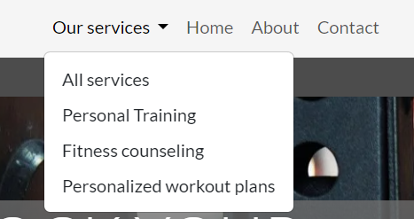
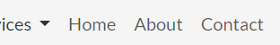
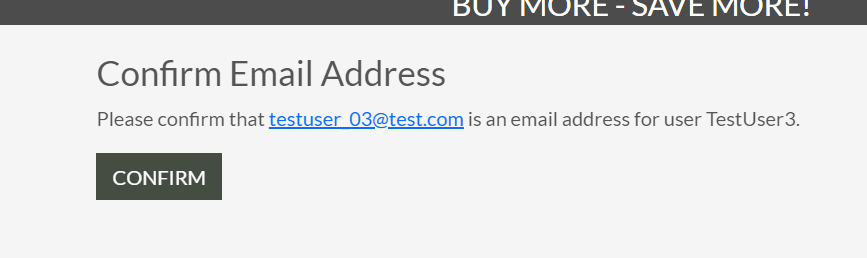
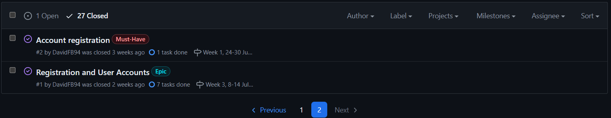

# [ProFit-PT](https://pro-fit-pt-dcb56d3b7224.herokuapp.com)

[](https://github.com/DavidFB94/pro-fit-pt/commits/main)

[](https://github.com/DavidFB94/pro-fit-pt/commits/main)

[](https://github.com/DavidFB94/pro-fit-pt)

## Overview

ProFit-PT is an e-commerce website where the customer can hire personal trainers for in person training, creating personalized workout plans, and fitness counseling.

The site includes helpful features such as a profile for registered users, an about page and a contact page.

The profile will help returning customers in faster checkout, and make their order history accessible in one place. The about/contact pages are included to show relevant information about the site, and make  contact between customers and site owner(s) simple.

This website was built as a project for the Diploma in Full Stack Software Development at Code Institute.

## Mockup


## UX

I started out with Wireframes for both desktop and mobile.

The basic structure for services and service details was created. I did not have any wireframes for the profile/cart/checkout, so I used the CI Boutique Ado walk-through for those pages.

After the base structure for viewing and purchasing services was complete, I moved on the the about/faqs/contact pages. Originally, I had planned for separate pages for all of them, but as the pages started taking shape, I combined some of their functionalities to make related information easier to find.

### Colour Scheme

-  `##4C4C4C` used for primary text.

-  `#f5f5f5` used for primary highlights.

-  `#FFFFFF` used for secondary text.

-  `#4C4C4CBF` used for secondary highlights.

I used [coolors.co](https://coolors.co/ffffff-f5f5f5-4c4c4c) to generate my colour palette.


### Typography

- [Lato](https://fonts.google.com/specimen/Lato) was used for all text.

- [Font Awesome](https://fontawesome.com) icons were used throughout the site, such as the search icon and tag icon for categories.

## User Stories

### Site Users

- As a customer I can register an account so that I can log in, and use the site in an authorized and secure way.

- As a customer I can  receive a email confirmation after account registration so that I know that my registration was successful.

- As a customer I can log in with my account information so that I can fully use the sites features.

- As a customer I can log out from my account so that I can avoid unauthorized access to my data.

- As a customer I can view services so that I can see the sites supply.

- As a customer I can view service details so that I can see detailed service information and make informed purchasing decisions.

- As a customer I can search for a service by name or description so that I can find a specific service I'd like to purchase.

- As a customer I can sort the list of services so that I can easily identify the product I might be interested in.

- As a customer I can add services to my shopping cart, view the contents of my cart and proceed to checkout, so that I can complete my purchase quickly and easily.

- As a customer I can proceed to checkout/payment so that I can pay for my services and enter my delivery information.

- As a customer I can receive a purchase confirmation e-mail so that I know that my order was successful.

- As a customer I can access my profile so that add/review information about my account.

- As a customer I can save my information so that I can have a faster checkout process when coming back to the site.

- As a customer I can view my order history so that I can track my purchases.

- As a customer I can fill out a contact form so that I can send messages to the site admin.

- As a customer I can find a FAQ section so that I can easily find answers to common questions regarding the site.

- As a customer I can sign up for a newsletter so that I can receive the latest news and deals.

### Site Admin

- As a site admin I can moderate users and their data in the admin dashboard so that I can make changes when required.

- As a site admin I can receive a contact form so that I can have direct contact with the customers.

- As a site admin I can mark contact messages as "read" so that I can keep track on which messages I have reviewed.

- As a site admin I can add/edit/delete FAQs so that I can make the site easier to use for the customer.

- As a site admin I can add/edit/delete services so that I can manage my service inventory.

## Wireframes
Wireframes were developed for mobile and desktop sizes.

I've used [Balsamiq](https://balsamiq.com/wireframes) to design my site wireframes.

### Mobile Wireframes

<details>
<summary> Click here to see the Mobile Wireframes </summary>

Home
- 

Services
- 

Service Details
- 

About
- 

Contact
- 

FAQs
- 

</details>

### Desktop Wireframes

<details>
<summary> Click here to see the Desktop Wireframes </summary>

Home
- 

Services
- 

Service Details
- 

About
- 

Contact
- 

FAQs
- 

</details>

## Features

### Existing Features

 **#1 Header with Logo home redirect**

- Adds maneuverability to the site.


**#2 Navbar links to "Our Services" in drop-down menu**

-  Includes links to all services and service categories. Adds maneuverability to the site.



**#3 Navbar links to Home, About and Contact section**

- Adds maneuverability to the site.



**#4 Search field**

- For search queries. Adds maneuverability to the site. Makes it easier for the user to find what they are looking for.


**#5 "My Account" drop-down menu**

- Includes link to register/login/logout, profile page (registered users), and "Add Services" (for admin users only). Adds maneuverability to the site.


**#6 Cart display**

- Updates with cart content being added. Displays total cost. Link to "Shopping cart". Adds maneuverability to the site. Provides visual feedback for the user. Displays a cart preview when an item is added, with link to shopping cart.


**#7 Site Banner**

- Highlights the sites deal to get price reduction for buying more services at once. Will encourage users to buy more.


**#8 Feedback messages**

- Toast messages are displayed on user action. Message: Success, Error and Info. Provides instant feedback to the user.


**#9 Landing page**

- Includes inspiring message for the sites services and link to Personal Training category. Adds maneuverability to the site. Makes it easy for the user to find the sites main service.


**#10 Our services cards**

- Services display with all services, shown in a paginated list. Includes "Services home" link, number of found services, sorting and current category (if selected). Displays service name, image, category tag, description and starting price.


**#11 Service cards edit/delete links (ADMIN ONLY)**

-  Links to edit/delete a service (ADMIN ONLY). Includes a delete confirmation popup modal.


**#12 Service cards Read More link**

- "Read More" link to service details.


**#13 Service details**

- Display service details. Displays service name, image, category tag, full description. Includes "Buy sessions" section, with quantity selection drop-down, price per unit + total price, and "Add to cart" link. Also includes edit/delete links (ADMIN ONLY).


**#14 Add service (ADMIN ONLY)**

- Add service form to add a new service to the database. Uses checkboxes for adding pricingtiers. Image field where an image can be added. Cancel button with redirect to all services. Add button so submit the form.


**#15 Edit service (ADMIN ONLY)**

- Edit service form to edit a  service in the database. Pre-fills fields with current information (not pricingtier or current image). Checkbox for deleting current image, or a new image can be added by selecting a new file which will override the current one. Cancel button with redirect to all services. Update button so submit the form.


**#16 Shopping Cart**

- Displays items in the cart with service info and grand total. Includes links to keep shopping, remove an item and checkout.


**#17 Checkout**

- Checkout form with order summery. Includes option to save customer information to their profile (if registered user), card payments with Stripe, link back to current cart, total charge amount, and complete order button. Redirects to checkout success page.


**#18 Checkout success page**

- Displays an order summary, and order e-mail confirmation 


**#19 User registration**

- Sign Up form for user registration. Includes links to home page, and sign up button for completing the form. User verification
by email.





**#20 User Sign in**

- Sign in form for user login. Includes links to home page, and confirmation button for signing in. 


**#21 User Log out**

- Log out screen with log out confirmation. 


**#22 User Profile**

- Default User Information form and order history. Includes option to save/update customer information to their profile (if registered user), which will be used in the next checkout. Order history includes links to the order summary on previous orders.


**#23 About page**

- About us section with site description, links to partners, facebook and privacy statement. FAQs section with accordion to save screen space (FAQs can be added/edited/removed in admin dashboard). Newsletter signup form.


**#24 Contact page**

- Includes contact form to send a message to the admin (can be read in the contacs tab in the dashboard) and a section for phone contact and phone-line operating hours. 


**#25 Mobile Navbar**

- Includes links to navigation in burger dropdown menu. Adds maneuverability to the site for mobile users. Saves screen space.


**#26 404-page**

- Error page when a user is trying to access a non-existing service. Includes a link back to services. Adds maneuverability to the site.


**#27 Admin user management**

- Admin dashboard user management. To be able to moderate users.


**#28 Admin contact management**

- Admin dashboard contact management. To be able to read messages, and mark them as read.


**#29 Admin FAQ management**

- Admin dashboard FAQ management. To be able to create/edit/delete FAQs.


### Future Features

 **#1 Front end pricing tier creation**

- Allowing for new pricing tiers to be created in the front end for admins.

## Tools & Technologies Used

- [](https://tim.2bn.dev/markdown-builder) used to generate README and TESTING templates.

- [](https://git-scm.com) used for version control. (`git add`, `git commit`, `git push`)

- [](https://github.com) used for secure online code storage.

- [](https://gitpod.io) used as a cloud-based IDE for development.

- [](https://en.wikipedia.org/wiki/HTML) used for the main site content.

- [](https://en.wikipedia.org/wiki/CSS) used for the main site design and layout.

- [](https://www.javascript.com) used for user interaction on the site.

- [](https://jquery.com) used for user interaction on the site.

- [](https://www.python.org) used as the back-end programming language.

- [](https://www.heroku.com) used for hosting the deployed back-end site.

- [](https://getbootstrap.com) used as the front-end CSS framework for modern responsiveness and pre-built components.

- [](https://www.djangoproject.com) used as the Python framework for the site.

- [](https://www.postgresql.org) used as the relational database management.

- [](https://dbs.ci-dbs.net) used as the Postgres database from Code Institute.

- [](https://cloudinary.com) used for online static file storage.

- [](https://whitenoise.readthedocs.io) used for serving static files with Heroku.

- [](https://stripe.com) used for online secure payments of ecommerce products/services.

- [](https://mail.google.com) used for sending emails in my application.

- [](https://balsamiq.com/wireframes) used for creating wireframes.

- [](https://fontawesome.com) used for the icons.

- [](https://chat.openai.com) used to help debug, troubleshoot, code suggestions and explain things.

- [[Miro]](https://miro.com/) used to build initial ERD.

- [[TinyPNG]](https://tinypng.com/) image compression.

- [[Pixelied]](https://pixelied.com/convert/jpg-converter/jpg-to-webp) image format converter.

## Database Design

Initial ERD:


Entity Relationship Diagrams (ERD) help to visualize database architecture before creating models.

Understanding the relationships between different tables can save time later in the project.

I have used `pygraphviz` and `django-extensions` to auto-generate an ERD.

The steps taken were as follows:

- In the terminal: `sudo apt update`

- then: `sudo apt-get install python3-dev graphviz libgraphviz-dev pkg-config`

- then type `Y` to proceed

- then: `pip3 install django-extensions pygraphviz`

- in my `settings.py` file, I added the following to my `INSTALLED_APPS`:

```python

INSTALLED_APPS = [

...

'django_extensions',

...

]

```

- back in the terminal: `python3 manage.py graph_models -a -o erd.png`

- dragged the new `erd.png` file into my `documentation/` folder

- removed `'django_extensions',` from my `INSTALLED_APPS`

- finally, in the terminal: `pip3 uninstall django-extensions pygraphviz -y`

  


source: [medium.com](https://medium.com/@yathomasi1/1-using-django-extensions-to-visualize-the-database-diagram-in-django-application-c5fa7e710e16)

## Agile Development Process

### GitHub Projects

[GitHub Projects](https://github.com/DavidFB94/pro-fit-pt/projects) served as an Agile tool for this project.

It isn't a specialized tool, but with the right tags and project creation/issue assignments, it can be made to work.

Through it, user stories, issues, and milestone tasks were planned, then tracked on a weekly basis using the basic Kanban board.


### GitHub Issues

[GitHub Issues](https://github.com/DavidFB94/pro-fit-pt/issues) served as an another Agile tool.

There, I used my own **User Story Template** to manage user stories.

It also helped with milestone iterations on a weekly basis.


- [Open Issues](https://github.com/DavidFB94/pro-fit-pt/issues) [](https://github.com/DavidFB94/pro-fit-pt/issues)


- [Closed Issues](https://github.com/DavidFB94/pro-fit-pt/issues?q=is%3Aissue+is%3Aclosed) [](https://github.com/DavidFB94/pro-fit-pt/issues?q=is%3Aissue+is%3Aclosed)




### MoSCoW Prioritization

I've decomposed my Epics into stories prior to prioritizing and implementing them.

Using this approach, I was able to apply the MoSCow prioritization and labels to my user stories within the Issues tab.

-  **Must Have**: guaranteed to be delivered (*max 60% of stories*)

-  **Should Have**: adds significant value, but not vital (*the rest ~20% of stories*)

-  **Could Have**: has small impact if left out (*20% of stories*)

-  **Won't Have**: not a priority for this iteration

## Ecommerce Business Model

This site sells goods to individual customers, and therefore follows a `Business to Customer` model.

It is of the simplest **B2C** forms, as it focuses on individual transactions, and doesn't need anything such as monthly/annual subscriptions.

It is still in its early development stages, although it already has a newsletter, and links for social media marketing.

Social media can potentially build a community of users around the business, and boost site visitor numbers, especially when using larger platforms such a Facebook.

A newsletter list can be used by the business to send regular messages to site users.

For example, what items are on special offer, new items in stock, updates to business hours, notifications of events, and much more!

## Search Engine Optimization (SEO) & Social Media Marketing

### Keywords

I've identified some appropriate keywords to align with my site, that should help users when searching online to find my page easily from a search engine.

This included a series of the following keyword types


I also played around with [Word Tracker](https://www.wordtracker.com) a bit to check the frequency of some of my site's primary keywords (only until the free trial expired).

### Sitemap

I've used [XML-Sitemaps](https://www.xml-sitemaps.com) to generate a sitemap.xml file.

This was generated using my deployed site URL: https://pro-fit-pt-dcb56d3b7224.herokuapp.com

After it finished crawling the entire site, it created a
[sitemap.xml](sitemap.xml) which I've downloaded and included in the repository.

### Robots

I've created the [robots.txt](robots.txt) file at the root-level.

Inside, I've included the default settings:

```

User-agent: *

Disallow:

Sitemap: https://pro-fit-pt-dcb56d3b7224.herokuapp.com/sitemap.xml

```


Further links for future implementation:

- [Google search console](https://search.google.com/search-console)

- [Creating and submitting a sitemap](https://developers.google.com/search/docs/advanced/sitemaps/build-sitemap)

- [Managing your sitemaps and using sitemaps reports](https://support.google.com/webmasters/answer/7451001)

- [Testing the robots.txt file](https://support.google.com/webmasters/answer/6062598)

### Social Media Marketing

Creating a strong social base (with participation) and linking that to the business site can help drive sales.

Using more popular providers with a wider user base, such as Facebook, typically maximizes site views.

I've created a Facebook business account.


### Newsletter Marketing

I have incorporate a newsletter sign-up form on my application, to allow users to supply their email address if they are interested in learning more.

## Testing

> [!NOTE]
> For all testing, please refer to the [TESTING.md](TESTING.md) file.

## Deployment

The live deployed application can be found deployed on [Heroku](https://pro-fit-pt-dcb56d3b7224.herokuapp.com).

### PostgreSQL Database

This project uses a [Code Institute PostgreSQL Database](https://dbs.ci-dbs.net).

To obtain my own Postgres Database from Code Institute, I followed these steps:

- Signed-in to the CI LMS using my email address.

- An email was sent to me with my new Postgres Database.

> [!CAUTION]
>  - PostgreSQL databases by Code Institute are only available to CI Students.
>  - You must acquire your own PostgreSQL database through some other method
> if you plan to clone/fork this repository.
>  - Code Institute students are allowed a maximum of 8 databases.
>  - Databases are subject to deletion after 18 months.

### WhiteNoise

This project uses [Whitenoise](https://whitenoise.readthedocs.io/en/latest/) to store static files online, due to the fact that Heroku doesn't persist this type of data.

To install whitenoise, run the `pip install whitenoise` command.

Edit your settings.py file and add WhiteNoise to the MIDDLEWARE list. The WhiteNoise middleware should be placed directly after the Django SecurityMiddleware (if you are using it) and before all other middleware:

```
MIDDLEWARE = [
    # ...
    "django.middleware.security.SecurityMiddleware",
    "whitenoise.middleware.WhiteNoiseMiddleware",
    # ...
]
```

### Cloudinary

This project uses [Cloudinary](https://cloudinary.com) for online static file storage.

To install Cloudinary, run the `pip install cloudinary` and `pip install dj3-cloudinary-storage` commands.

Edit your settings.py file and add cloudinary_storage and cloudinary to the INSTALLED_APPS list. Note that cloudinary_storage should be placed directly after the django.contrib.staticfiles.

```
INSTALLED_APPS = [
    # ...
    "django.contrib.staticfiles",
    "cloudinary_storage",
    # ...
    "cloudinary",
]
```

#### Generating a cloudinary environment variable

To sign up for cloudinary, visit [Cloudinary.com](https://cloudinary.com). 

Once you've created a Cloudinary account and logged-in, follow these series of steps to get your project connected.

- From your Cloudinary dashboard, click  "API keys".
- Generate a new API key. 
- Name it and copy your generated API environment variable.
- Your API Key and API Secret is found in your generated key. The cloud name should be automatically generated.
- Fill in your environment variable using this format:
`CLOUDINARY_URL=cloudinary://<your_api_key>:<your_api_secret>@<your_cloud_name>`

### Stripe API

This project uses [Stripe](https://stripe.com) to handle the ecommerce payments.

Once you've created a Stripe account and logged-in, follow these series of steps to get your project connected.

- From your Stripe dashboard, click to expand the "Get your test API keys".

- You'll have two keys here:

-  `STRIPE_PUBLIC_KEY` = Publishable Key (starts with **pk**)

-  `STRIPE_SECRET_KEY` = Secret Key (starts with **sk**)

As a backup, in case users prematurely close the purchase-order page during payment, we can include Stripe Webhooks.

- From your Stripe dashboard, click **Developers**, and select **Webhooks**.

- From there, click **Add Endpoint**.

-  `https://pro-fit-pt-dcb56d3b7224.herokuapp.com/checkout/wh/`

- Click **receive all events**.

- Click **Add Endpoint** to complete the process.

- You'll have a new key here:

-  `STRIPE_WH_SECRET` = Signing Secret (Wehbook) Key (starts with **wh**)

### Gmail API

This project uses [Gmail](https://mail.google.com) to handle sending emails to users for account verification and purchase order confirmations.

Once you've created a Gmail (Google) account and logged-in, follow these series of steps to get your project connected.

- Click on the **Account Settings** (cog icon) in the top-right corner of Gmail.

- Click on the **Accounts and Import** tab.

- Within the section called "Change account settings", click on the link for **Other Google Account settings**.

- From this new page, select **Security** on the left.

- Select **2-Step Verification** to turn it on. (verify your password and account)

- Once verified, select **Turn On** for 2FA.

- Navigate back to the **Security** page, and you'll see a new option called **App passwords**.

- This might prompt you once again to confirm your password and account.

- Select **Mail** for the app type.

- Select **Other (Custom name)** for the device type.

- Any custom name, such as "Django" or pro-fit-pt

- You'll be provided with a 16-character password (API key).

- Save this somewhere locally, as you cannot access this key again later!

-  `EMAIL_HOST_PASS` = user's 16-character API key

-  `EMAIL_HOST_USER` = user's own personal Gmail email address

### Heroku Deployment

This project uses [Heroku](https://www.heroku.com), a platform as a service (PaaS) that enables developers to build, run, and operate applications entirely in the cloud.

Deployment steps are as follows, after account setup:

- Select **New** in the top-right corner of your Heroku Dashboard, and select **Create new app** from the dropdown menu.

- Your app name must be unique, and then choose a region closest to you (EU or USA), and finally, select **Create App**.

- From the new app **Settings**, click **Reveal Config Vars**, and set your environment variables.

> [!IMPORTANT]
> This is a sample only; you would replace the values with your own if cloning/forking my repository.
  

| Key | Value |
| --- | --- |
| `CLOUDINARY_URL` | user's own value |
| `DATABASE_URL` | user's own value |
| `DISABLE_COLLECTSTATIC` | 1 (*this is temporary, and can be removed for the final deployment*) |
| `EMAIL_HOST_PASS` | user's own value |
| `EMAIL_HOST_USER` | user's own value |
| `SECRET_KEY` | user's own value |
| `STRIPE_PUBLIC_KEY` | user's own value |
| `STRIPE_SECRET_KEY` | user's own value |
| `STRIPE_WH_SECRET` | user's own value |

Heroku needs three additional files in order to deploy properly.

- requirements.txt

- Procfile

- runtime.txt

You can install this project's **requirements** (where applicable) using:

-  `pip3 install -r requirements.txt`

If you have your own packages that have been installed, then the requirements file needs updated using:

-  `pip3 freeze --local > requirements.txt`

The **Procfile** can be created with the following command:

-  `echo web: gunicorn app_name.wsgi > Procfile`

-  *replace **app_name** with the name of your primary Django app name; the folder where settings.py is located*

The **runtime.txt** file needs to know which Python version you're using:

1. type: `python3 --version` in the terminal.

2. in the **runtime.txt** file, add your Python version:

-  `python-3.9.19`

For Heroku deployment, follow these steps to connect your own GitHub repository to the newly created app:

Either:

- Select **Automatic Deployment** from the Heroku app.

Or:
  
- In the Terminal/CLI, connect to Heroku using this command: `heroku login -i`

- Set the remote for Heroku: `heroku git:remote -a app_name` (replace *app_name* with your app name)

- After performing the standard Git `add`, `commit`, and `push` to GitHub, you can now type:

-  `git push heroku main`

The project should now be connected and deployed to Heroku!

### Local Deployment

This project can be cloned or forked in order to make a local copy on your own system.

For either method, you will need to install any applicable packages found within the *requirements.txt* file.

-  `pip3 install -r requirements.txt`.

  

You will need to create a new file called `env.py` at the root-level,

and include the same environment variables listed above from the Heroku deployment steps.

> [!IMPORTANT]
> This is a sample only; you would replace the values with your own if cloning/forking my repository.

Sample `env.py` file:

```python

import os
 

os.environ.setdefault("CLOUDINARY_URL", "user's own value")

os.environ.setdefault("DATABASE_URL", "user's own value")

os.environ.setdefault("EMAIL_HOST_PASS", "user's own value")

os.environ.setdefault("EMAIL_HOST_USER", "user's own value")

os.environ.setdefault("SECRET_KEY", "user's own value")

os.environ.setdefault("STRIPE_PUBLIC_KEY", "user's own value")

os.environ.setdefault("STRIPE_SECRET_KEY", "user's own value")

os.environ.setdefault("STRIPE_WH_SECRET", "user's own value")


# local environment only (do not include these in production/deployment!)

os.environ.setdefault("DEBUG", "True")

```
Once the project is cloned or forked, in order to run it locally, you'll need to follow these steps:

- Start the Django app: `python3 manage.py runserver`

- Stop the app once it's loaded: `CTRL+C` or `⌘+C` (Mac)

- Make any necessary migrations: `python3 manage.py makemigrations`

- Migrate the data to the database: `python3 manage.py migrate`

- Create a superuser: `python3 manage.py createsuperuser`

- Load fixtures (if applicable): `python3 manage.py loaddata file-name.json` (repeat for each file)

- Everything should be ready now, so run the Django app again: `python3 manage.py runserver`

If you'd like to backup your database models, use the following command for each model you'd like to create a fixture for:

-  `python3 manage.py dumpdata your-model > your-model.json`

-  *repeat this action for each model you wish to backup*

#### Cloning

You can clone the repository by following these steps:

1. Go to the [GitHub repository](https://github.com/DavidFB94/pro-fit-pt)

2. Locate the Code button above the list of files and click it

3. Select if you prefer to clone using HTTPS, SSH, or GitHub CLI and click the copy button to copy the URL to your clipboard

4. Open Git Bash or Terminal

5. Change the current working directory to the one where you want the cloned directory

6. In your IDE Terminal, type the following command to clone my repository:

-  `git clone https://github.com/DavidFB94/pro-fit-pt.git`

7. Press Enter to create your local clone.

Alternatively, if using Gitpod, you can click below to create your own workspace using this repository. 

[](https://gitpod.io/#https://github.com/DavidFB94/pro-fit-pt)

Please note that in order to directly open the project in Gitpod, you need to have the browser extension installed.

A tutorial on how to do that can be found [here](https://www.gitpod.io/docs/configure/user-settings/browser-extension).

#### Forking

By forking the GitHub Repository, we make a copy of the original repository on our GitHub account to view and/or make changes without affecting the original owner's repository.

You can fork this repository by using the following steps:

1. Log in to GitHub and locate the [GitHub Repository](https://github.com/DavidFB94/pro-fit-pt)

2. At the top of the Repository (not top of page) just above the "Settings" Button on the menu, locate the "Fork" Button.

3. Once clicked, you should now have a copy of the original repository in your own GitHub account!

### Local VS Deployment

There are no significant differences between local vs deployed version.

## Credits

### Content

The core e-commerce functionalities and templates (services + checkout flow + alerts + payments) in this project was set up following Code Institutes walk-through. After the core functionalities were in place, adjustments were made to accommodate my design for the site.

| Source | Location | Notes |
| --- | --- | --- |
| [Markdown Builder](https://tim.2bn.dev/markdown-builder) | README and TESTING | tool to help generate the Markdown files |
| [Djangoproject](https://docs.djangoproject.com/en/5.0/ref/contrib/messages/) | views | Setting up Django messages |
| [Djangoproject](https://docs.djangoproject.com/en/5.0/ref/models/querysets/#django.db.models.query.QuerySet.distinct) | views | Using distinct() for fetching unique service |
| [Bootstrap5](https://getbootstrap.com/docs/5.3/layout/grid/) | Page layout | Using Bootstrap grid system |
| [Bootstrap5](https://getbootstrap.com/docs/5.3/components/navbar/) | main-nav.html | navbar with dropdown |
| [Bootstrap5](https://getbootstrap.com/docs/5.3/components/modal/) | services + service details | interactive pop-up (modal) for delete confirmation |
| [Bootstrap5](https://getbootstrap.com/docs/5.3/components/card/) | services + service details | card layout |
| [Bootstrap5](https://getbootstrap.com/docs/5.3/components/accordion/) | about | FAQs accordion |
| [WhiteNoise](http://whitenoise.evans.io) | entire site | hosting static files on Heroku temporarily |
| [Cloudinary](https://cloudinary.com/documentation/django_image_and_video_upload#django_forms_and_models_workflow) | services + service details | how to use cloudinary field | 
| [ChatGPT](https://chatgpt.com) | entire site | to help me troubleshoot a few bugs I had, as well as explain some coding concepts used from the walkthrough lesson |

### Media

| Source | Location | Type | Notes |
| --- | --- | --- | --- |
| [Freepik](https://www.freepik.com/free-photo/personal-trainer-gym_2833883.htm) | home page | image | Background image |
| [Pexels](https://www.pexels.com/sv-se/foto/man-par-kvinna-ansiktslosa-6456305/) | services + service details | image | Counseling image |
| [Pexels](https://www.pexels.com/sv-se/foto/1566404/) | services + service details | image | PT Weightlifting image |
| [Pexels](https://www.pexels.com/sv-se/foto/halsosam-man-avslappning-sport-6787357/) | services + service details | image | PT Wellness image |
| [Unsplash](https://unsplash.com/photos/black-adjustable-weight-barbell-E3wehabi_B4) | services + service details | image | PT Power-lifting image |
| [iStockphoto](https://www.istockphoto.com/photo/fast-hurdles-and-team-of-women-on-track-running-in-race-marathon-or-competition-in-gm1731418452-541785099?searchscope=image%2Cfilm) | services + service details | image | PT Athletics image |
| [StockAdobe](https://stock.adobe.com/images/no-image-vector-illustration-isolated/284645131) | services + service details | image | No image placeholder |
| [Bodybuilding](https://www.bodybuilding.com/content/the-14-best-biceps-exercises-for-men.html) | services + service details | image | PT Bodybuilding image |
| [Canva](https://www.canva.com/p/templates/EAF6H5jJzeA-orange-and-yellow-bold-minimal-fitness-log-planner/) | services + service details | image | Workout plan image |
| [Fontawesome](https://fontawesome.com/) | entire site | icons | Icons for profile, cart, search, category tag etc.. |

### Acknowledgements

- I would like to thank my Code Institute mentor, [Tim Nelson](https://github.com/TravelTimN) for his support throughout the development of this project.

- I would like to thank the [Code Institute](https://codeinstitute.net) tutor team for their assistance with troubleshooting and debugging some project issues.

- I would like to thank my wife Maria for believing in me, and allowing me to make this transition into software development.