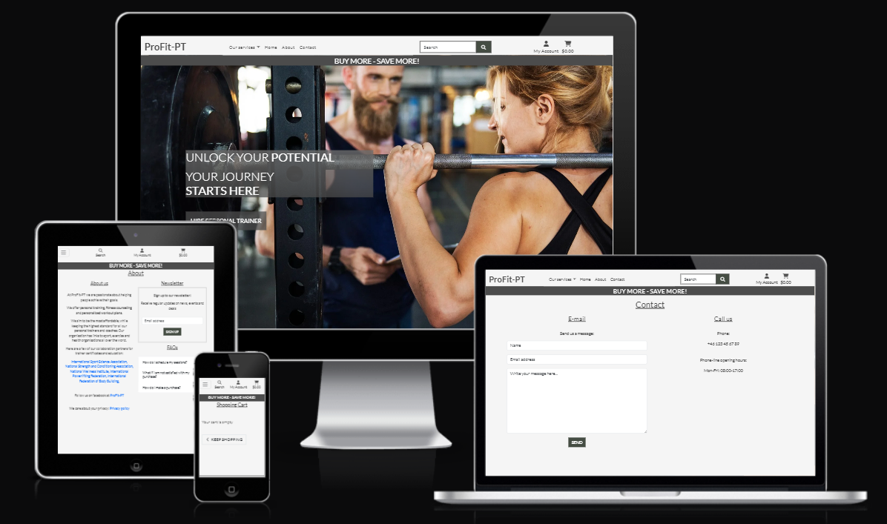
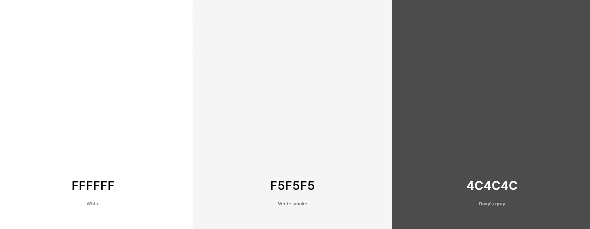

# [ProFit-PT](https://pro-fit-pt-dcb56d3b7224.herokuapp.com)

## Overview

ProFit-PT is an e-commerce website where the customer can hire personal trainers for in person training, creating personalized workout plans, and fitness counseling.

This website was built as a project for the Diploma in Full Stack Software Development at Code Institute.

## Mockup

## UX

I started out with Wireframes for both desktop and mobile.

The basic structure for services and service details was created. I did not have any wireframes for the profile/cart/checkout, so I used the CI Boutique Ado walk-through for those pages.

After the base structure for viewing and purchasing services was complete, I moved on the the about/faqs/contact pages. Originally, I had planned for separate pages for all of them, but as the pages started taking shape, I combined some of their functionalities to make related information easier to find.

### Colour Scheme

-  `##4C4C4C` used for primary text.

-  `#f5f5f5` used for primary highlights.

-  `#FFFFFF` used for secondary text.

-  `#4C4C4CBF` used for secondary highlights.

I used [coolors.co](https://coolors.co/ffffff-f5f5f5-4c4c4c) to generate my colour palette.

### Typography

- [Lato](https://fonts.google.com/specimen/Lato) was used for all text.

- [Font Awesome](https://fontawesome.com) icons were used throughout the site, such as the search icon and tag icon for categories.

## User Stories

### Site Users

- As a customer I can register an account so that I can log in, and use the site in an authorized and secure way.

- As a customer I can  receive a email confirmation after account registration so that I know that my registration was successful.

- As a customer I can log in with my account information so that I can fully use the sites features.

- As a customer I can log out from my account so that I can avoid unauthorized access to my data.

- As a customer I can view services so that I can see the sites supply.

- As a customer I can view service details so that I can see detailed service information and make informed purchasing decisions.

- As a customer I can search for a service by name or description so that I can find a specific service I'd like to purchase.

- As a customer I can sort the list of services so that I can easily identify the product I might be interested in.

- As a customer I can add services to my shopping cart, view the contents of my cart and proceed to checkout, so that I can complete my purchase quickly and easily.

- As a customer I can proceed to checkout/payment so that I can pay for my services and enter my delivery information.

- As a customer I can receive a purchase confirmation e-mail so that I know that my order was successful.

- As a customer I can access my profile so that add/review information about my account.

- As a customer I can save my information so that I can have a faster checkout process when coming back to the site.

- As a customer I can view my order history so that I can track my purchases.

- As a customer I can fill out a contact form so that I can send messages to the site admin.

- As a customer I can find a FAQ section so that I can easily find answers to common questions regarding the site.

- (Future Feature) As a customer I can sign up for a newsletter so that I can receive the latest news and deals.

### Site Admin

- As a site admin I can moderate users and their data in the admin dashboard so that I can make changes when required.

- As a site admin I can receive a contact form so that I can have direct contact with the customers.

- As a site admin I can mark contact messages as "read" so that I can keep track on which messages I have reviewed.

- As a site admin I can add/edit/delete FAQs so that I can make the site easier to use for the customer.

- As a site admin I can add/edit/delete services so that I can manage my service inventory.

- (Future Feature) As a site admin I can send mass emails to users, if they have signed up for it, so that I can increase traffic and sales on the site.

## Wireframes
Wireframes were developed for mobile and desktop sizes.

I've used [Balsamiq](https://balsamiq.com/wireframes) to design my site wireframes.

### Mobile Wireframes

 Click here to see the Mobile Wireframes 

Home
- 

Services
- 

Service Details
- 

About
- 

Contact
- 

FAQs
- 

### Desktop Wireframes

 Click here to see the Desktop Wireframes 

Home
- 

Services
- 

Service Details
- 

About
- 

Contact
- 

FAQs
- 

