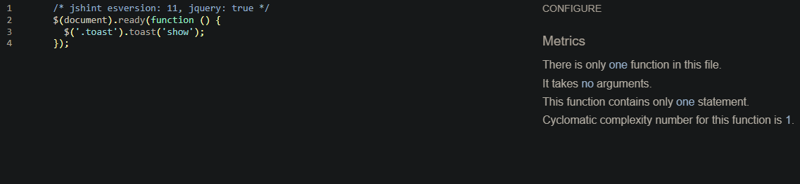
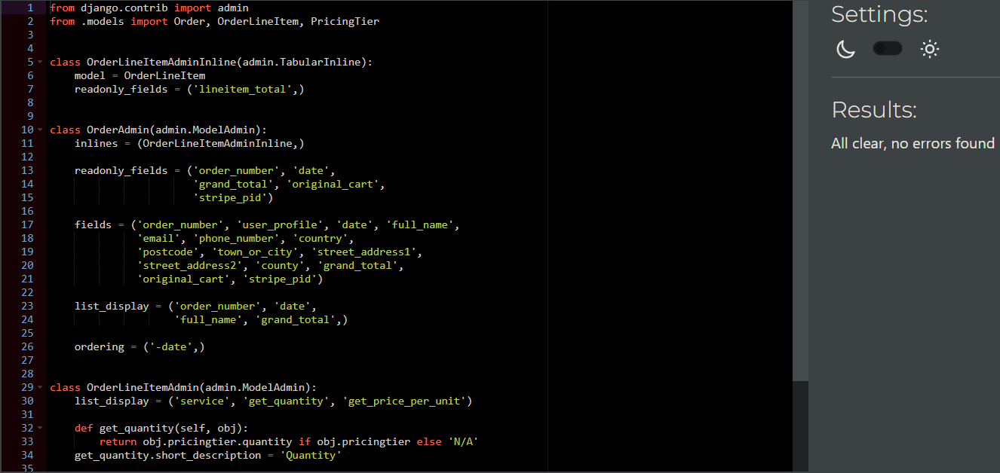
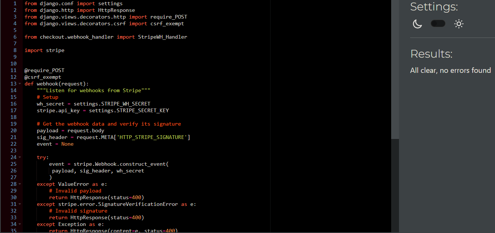
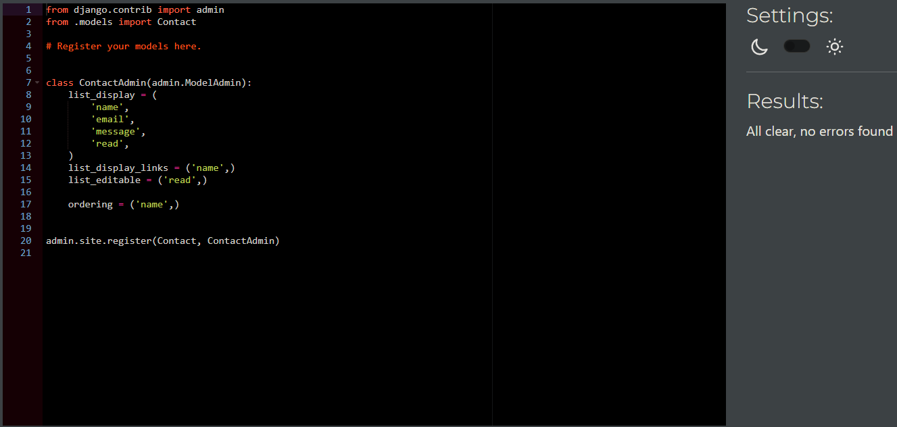
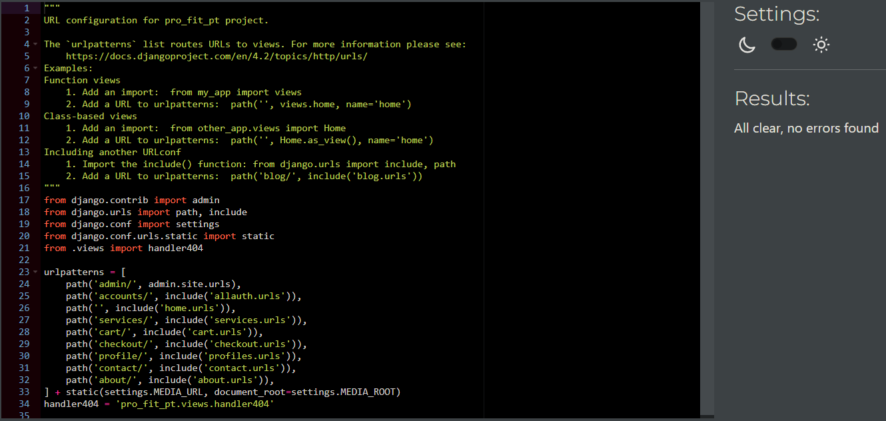
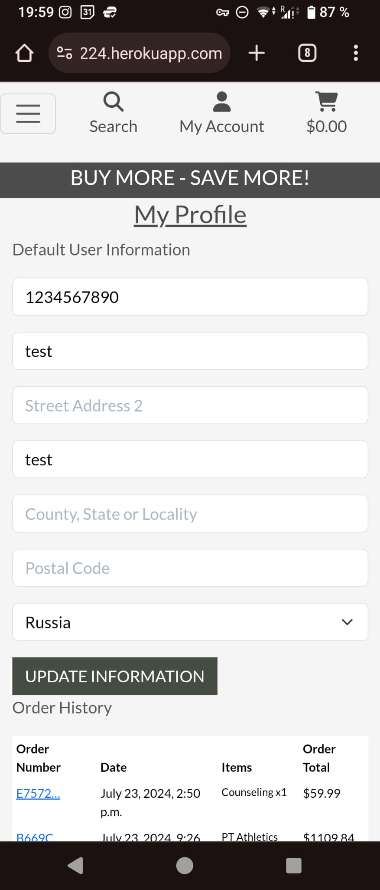
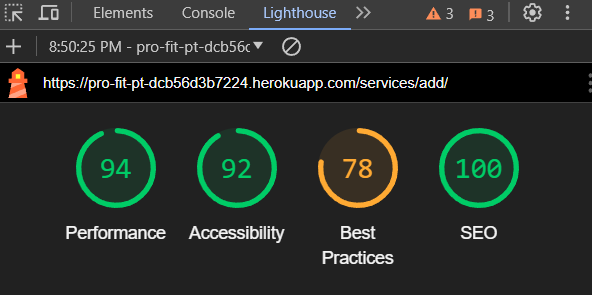

# Testing

> [!NOTE]  
> Return back to the [README.md](README.md) file.

## Code Validation

### HTML

I have used the recommended [HTML W3C Validator](https://validator.w3.org) to validate all of my HTML files.

| Directory | File | Screenshot | Notes |
| --- | --- | --- | --- |
| about | about.html |  | No errors |
| cart | cart.html |  | No errors |
| checkout | checkout.html |  | No errors |
| checkout | checkout_success.html |  | No errors |
| contact | contact.html |  | No errors |
| home | index.html |  | No errors |
| profiles | profile.html |  | No errors |
| services | services.html | 
| services | add_service.html |  | No errors |
| services | edit_service.html |  | No errors |
| services | service_details.html |  | No errors |
| root | 404.html | | No errors |
| signup | signup.html | | No errors |
| login | login.html | | No errors |
| logout | logout.html | | No errors |

### CSS

I have used the recommended [CSS Jigsaw Validator](https://jigsaw.w3.org/css-validator) to validate all of my CSS files.

| Directory | File | Screenshot | Notes |
| --- | --- | --- | --- |
| checkout | checkout.css |  | No errors |
| profiles | profile.css.png |  | No errors |
| static | base.css |  | No errors |

### JavaScript

I have used the recommended [JShint Validator](https://jshint.com) to validate all of my JS files.

| Directory | File | Screenshot | Notes |
| --- | --- | --- | --- |
| base | base.html |  | |
| cart | cart.html |  | |
| checkout | stripe_elements.js |  | |
| profiles | countryfield.js |  | |
| services | sort_services.js |  | |
| services | total_price.js |  | |

### Python

I have used the recommended [PEP8 CI Python Linter](https://pep8ci.herokuapp.com) to validate all of my Python files.

| Directory | File | CI URL | Screenshot | Notes |
| --- | --- | --- | --- | --- |
| about | admin.py | [PEP8 CI](https://pep8ci.herokuapp.com/https://raw.githubusercontent.com/DavidFB94/pro-fit-pt/main/about/admin.py) |  | No errors |
| about | forms.py | [PEP8 CI](https://pep8ci.herokuapp.com/https://raw.githubusercontent.com/DavidFB94/pro-fit-pt/main/about/forms.py) |  | No errors |
| about | models.py | [PEP8 CI](https://pep8ci.herokuapp.com/https://raw.githubusercontent.com/DavidFB94/pro-fit-pt/main/about/models.py) |  | No errors |
| about | urls.py | [PEP8 CI](https://pep8ci.herokuapp.com/https://raw.githubusercontent.com/DavidFB94/pro-fit-pt/main/about/urls.py) |  | No errors |
| about | views.py | [PEP8 CI](https://pep8ci.herokuapp.com/https://raw.githubusercontent.com/DavidFB94/pro-fit-pt/main/about/views.py) |  | No errors |
| cart | admin.py | [PEP8 CI](https://pep8ci.herokuapp.com/https://raw.githubusercontent.com/DavidFB94/pro-fit-pt/main/cart/admin.py) |  | No errors |
| cart | contexts.py | [PEP8 CI](https://pep8ci.herokuapp.com/https://raw.githubusercontent.com/DavidFB94/pro-fit-pt/main/cart/contexts.py) |  | No errors |
| cart | models.py | [PEP8 CI](https://pep8ci.herokuapp.com/https://raw.githubusercontent.com/DavidFB94/pro-fit-pt/main/cart/models.py) |  | No errors |
| cart | cart_tools.py | [PEP8 CI](https://pep8ci.herokuapp.com/https://raw.githubusercontent.com/DavidFB94/pro-fit-pt/main/cart/templatetags/cart_tools.py) |  | No errors |
| cart | urls.py | [PEP8 CI](https://pep8ci.herokuapp.com/https://raw.githubusercontent.com/DavidFB94/pro-fit-pt/main/cart/urls.py) |  | No errors |
| cart | views.py | [PEP8 CI](https://pep8ci.herokuapp.com/https://raw.githubusercontent.com/DavidFB94/pro-fit-pt/main/cart/views.py) |  | No errors |
| checkout | admin.py | [PEP8 CI](https://pep8ci.herokuapp.com/https://raw.githubusercontent.com/DavidFB94/pro-fit-pt/main/checkout/admin.py) |  | No errors |
| checkout | forms.py | [PEP8 CI](https://pep8ci.herokuapp.com/https://raw.githubusercontent.com/DavidFB94/pro-fit-pt/main/checkout/forms.py) |  | No errors |
| checkout | models.py | [PEP8 CI](https://pep8ci.herokuapp.com/https://raw.githubusercontent.com/DavidFB94/pro-fit-pt/main/checkout/models.py) |  | No errors |
| checkout | signals.py | [PEP8 CI](https://pep8ci.herokuapp.com/https://raw.githubusercontent.com/DavidFB94/pro-fit-pt/main/checkout/signals.py) |  | No errors |
| checkout | urls.py | [PEP8 CI](https://pep8ci.herokuapp.com/https://raw.githubusercontent.com/DavidFB94/pro-fit-pt/main/checkout/urls.py) |  | No errors |
| checkout | views.py | [PEP8 CI](https://pep8ci.herokuapp.com/https://raw.githubusercontent.com/DavidFB94/pro-fit-pt/main/checkout/views.py) |  | No errors |
| checkout | webhook_handler.py | [PEP8 CI](https://pep8ci.herokuapp.com/https://raw.githubusercontent.com/DavidFB94/pro-fit-pt/main/checkout/webhook_handler.py) |  | # noqa on line 43 |
| checkout | webhooks.py | [PEP8 CI](https://pep8ci.herokuapp.com/https://raw.githubusercontent.com/DavidFB94/pro-fit-pt/main/checkout/webhooks.py) |  | No errors |
| contact | admin.py | [PEP8 CI](https://pep8ci.herokuapp.com/https://raw.githubusercontent.com/DavidFB94/pro-fit-pt/main/contact/admin.py) |  | No errors |
| contact | forms.py | [PEP8 CI](https://pep8ci.herokuapp.com/https://raw.githubusercontent.com/DavidFB94/pro-fit-pt/main/contact/forms.py) |  | No errors |
| contact | models.py | [PEP8 CI](https://pep8ci.herokuapp.com/https://raw.githubusercontent.com/DavidFB94/pro-fit-pt/main/contact/models.py) |  | No errors |
| contact | urls.py | [PEP8 CI](https://pep8ci.herokuapp.com/https://raw.githubusercontent.com/DavidFB94/pro-fit-pt/main/contact/urls.py) |  | No errors |
| contact | views.py | [PEP8 CI](https://pep8ci.herokuapp.com/https://raw.githubusercontent.com/DavidFB94/pro-fit-pt/main/contact/views.py) |  | No errors |
| home | admin.py | [PEP8 CI](https://pep8ci.herokuapp.com/https://raw.githubusercontent.com/DavidFB94/pro-fit-pt/main/home/admin.py) |  | No errors |
| home | models.py | [PEP8 CI](https://pep8ci.herokuapp.com/https://raw.githubusercontent.com/DavidFB94/pro-fit-pt/main/home/models.py) |  | No errors |
| home | urls.py | [PEP8 CI](https://pep8ci.herokuapp.com/https://raw.githubusercontent.com/DavidFB94/pro-fit-pt/main/home/urls.py) |  | No errors |
| home | views.py | [PEP8 CI](https://pep8ci.herokuapp.com/https://raw.githubusercontent.com/DavidFB94/pro-fit-pt/main/home/views.py) |  | No errors |
|  | manage.py | [PEP8 CI](https://pep8ci.herokuapp.com/https://raw.githubusercontent.com/DavidFB94/pro-fit-pt/main/manage.py) |  | No errors |
| pro_fit_pt | settings.py | [PEP8 CI](https://pep8ci.herokuapp.com/https://raw.githubusercontent.com/DavidFB94/pro-fit-pt/main/pro_fit_pt/settings.py) |  | No errors |
| pro_fit_pt | urls.py | [PEP8 CI](https://pep8ci.herokuapp.com/https://raw.githubusercontent.com/DavidFB94/pro-fit-pt/main/pro_fit_pt/urls.py) | 
| pro_fit_pt | views.py | [PEP8 CI](https://pep8ci.herokuapp.com/https://raw.githubusercontent.com/DavidFB94/pro-fit-pt/main/pro_fit_pt/views.py) |  | No errors |
| profiles | admin.py | [PEP8 CI](https://pep8ci.herokuapp.com/https://raw.githubusercontent.com/DavidFB94/pro-fit-pt/main/profiles/admin.py) |  | No errors |
| profiles | forms.py | [PEP8 CI](https://pep8ci.herokuapp.com/https://raw.githubusercontent.com/DavidFB94/pro-fit-pt/main/profiles/forms.py) |  | No errors |
| profiles | models.py | [PEP8 CI](https://pep8ci.herokuapp.com/https://raw.githubusercontent.com/DavidFB94/pro-fit-pt/main/profiles/models.py) |  | No errors |
| profiles | urls.py | [PEP8 CI](https://pep8ci.herokuapp.com/https://raw.githubusercontent.com/DavidFB94/pro-fit-pt/main/profiles/urls.py) |  | No errors |
| profiles | views.py | [PEP8 CI](https://pep8ci.herokuapp.com/https://raw.githubusercontent.com/DavidFB94/pro-fit-pt/main/profiles/views.py) |  | No errors |
| services | admin.py | [PEP8 CI](https://pep8ci.herokuapp.com/https://raw.githubusercontent.com/DavidFB94/pro-fit-pt/main/services/admin.py) |  | No errors |
| services | forms.py | [PEP8 CI](https://pep8ci.herokuapp.com/https://raw.githubusercontent.com/DavidFB94/pro-fit-pt/main/services/forms.py) |  | No errors |
| services | models.py | [PEP8 CI](https://pep8ci.herokuapp.com/https://raw.githubusercontent.com/DavidFB94/pro-fit-pt/main/services/models.py) |  | No errors |
| services | urls.py | [PEP8 CI](https://pep8ci.herokuapp.com/https://raw.githubusercontent.com/DavidFB94/pro-fit-pt/main/services/urls.py) |  | No errors |
| services | views.py | [PEP8 CI](https://pep8ci.herokuapp.com/https://raw.githubusercontent.com/DavidFB94/pro-fit-pt/main/services/views.py) |  | No errors |

## Browser Compatibility

I've tested my deployed project on multiple browsers to check for compatibility issues.

| Browser | About  | Cart | Checkout | Checkout_success | Contact | Index | Profile | Add_service | Edit_service | Service_details | Services | 404 | Notes |
| --- | --- | --- | --- | --- | --- | --- | --- | --- | --- | --- | --- | --- |  --- | 
| Chrome |  |  |  |  | | | | | | |  |  |  Works as expected |
| Firefox |  |  |  |  | | | | | | |  |  |  Works as expected |
| Edge |  |  |  |  | | | | | | |  |  |  Works as expected |

## Responsiveness

I've tested my deployed project on multiple devices to check for responsiveness issues.

| Browser | About  | Cart | Checkout | Checkout_success | Contact | Index | Profile | Add_service | Edit_service | Service_details | Services | 404 | Notes |
| --- | --- | --- | --- | --- | --- | --- | --- | --- | --- | --- | --- | --- | --- |
| Mobile (DevTools) |  |  |  |  | | | | | | |  |  |  Works as expected |
| Tablet (DevTools) |  |  |  |  | | | | | | |  |  |  Works as expected |
| Desktop |  |  |  |  | | | | | | |  |  |  Works as expected |
| Sony Xperia 10 |  |  |  |  | | | | | | |  |  |  Works as expected |

## Lighthouse Audit
I've tested my deployed project using the Lighthouse Audit tool to check for any major issues.

| Page | Mobile | Desktop |
| --- | --- | --- |
| About |  |  |
| Cart |  |  |
| Checkout |  |  |
| Checkout_success |  |  |
| Contact |  |  |
| Index |  |  |
| Profile |  |  |
| Add_service |  |  |
| Edit_service |  |  |
| Service_details |  |  |
| Services |  |  |
| 404 |  |  |